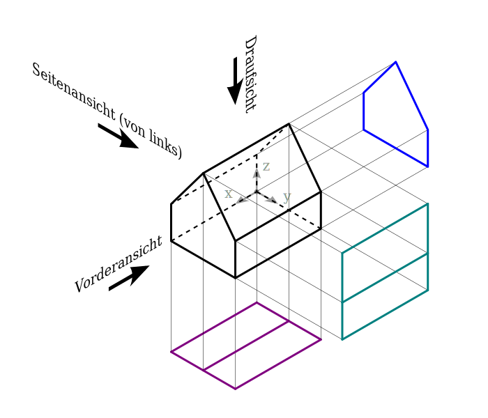

{width=80%}

## Daten als Fakten

- Reproduzierbar (z.B. sichere Messungen)

- Beschreiben die Wirklichkeit (z.B. Formalerschließung)

. . .

\hfill

*Problem: Gleiche Fakten, unterschiedliche Daten*

*Problem: Wirklichkeit wird auch durch Daten erzeugt/beeinflusst!*

## Daten als Beobachtungen

- Grundsätzlich subjektiv (z.B. Sacherschließung)

- Kontextwissen und Einordnung notwendig\
  (z.B. historische Forschungsdaten)

- Ursprünglich analoge Video/Audio-Aufzeichnungen

\hfill

*$\Rightarrow$ Für GLAM-Einrichtungen eher als Inhalte und Digitalisierung*

## Daten als (digitale) Dokumente

- Buchstaben, Zahlen, Bytes...

- Letzendlich eine Folge von Bits

- Zeichen unbekannter oder irrelevanter Bedeutung

\hfill

*Lassen sich gut automatisch verarbeiten*

*Problem: haben nur Struktur aber keine Bedeutung*

## Was können wir mit Daten anfangen?

- **Fakten:** Berechnungen, Statistiken, Analysen...

- **Beobachtungen**: Interpretation, Übersetzung, Anreicherung...

- **Dokumente**: Speicherung, Format-Konvertierung...

## Beispiel: Texterkennung (OCR)

- Eine Seite aus einem Buch wird gescannt\
  und per Texterkennung (OCR) verarbeitet

\hfill

- *Wo kommen bei diesem Prozess Daten vor?*

- *Welche Arten von (Meta)daten sind das*?

- *Welche Sichtweise spielt dabei jeweils eine Rolle?*

- *Welche Datenformate könnten verwendet werden?*

## Beispiel: Texterkennung (OCR)

| Daten             | Sichtweise         |
|-------------------|--------------------|
| -                 | Physische Realität |
| Gescannte Seite   | Beobachtung        |
| ggf. fehlerhaft erkannter Text | Beobachtung |
| richtig erkannter Text | Fakten |
| Datei (OCR, Unicode...) | Digitale Dokumente |

OCR-Dateiformate (hOCR, ALTO, PAGE, FineReader...):
<https://digi.bib.uni-mannheim.de/ocr-fileformat/>

# Datenmodellierung

## Motivation der Datenmodellierung

- Wie lässt sich zwischen Fakten (oder Aussagen)\
  und digitalen Dokumenten **übersetzen**?

- Wie können Systeme Daten **einheitlich verarbeiten**?

- Woher bekommen Daten (als digitale Dokumente)\
  ihre **Bedeutung**?

- Die Beobachtungssicht (Kontext, Relevanz, Anwendung...)\
  ist hier eher unwichtig

    - nicht korrekt im Sinne von richtige Angaben (richtig)

    - sondern korrekt im Sinne von richtig strukturiert (zulässig)

## Ergebnis der Datenmodellierung

- Objekte, Entitäten, Eigenschaften, Beziehungen...\

  _Beispiele:_ Person, Name, Alter, Schuhgröße...

- Kodierung in Form von digitalen Dokumenten

  _Beispiele:_ Datentypen, Tabellen, Zeichen...

*Datenmodellierung und Kodierung verläuft über mehrere Ebenen*

## Ebenen der Datenmodellierung

*Gleiche Daten, unterschiedliche Kodierungsebenen*

- Wirklichkeit bzw. deren Beobachtungen
- Vorstellungen/Modelle
- Datenmodell*
- Datenformat
- Syntax 
- Zeichen/Kodierung
- Bytes
- Bits

## Ebenen der Datenmodellierung

*Verschiedene Werkzeuge je nach Kodierungsebene*

- Wirklichkeit bzw. deren Beobachtungen $\Rightarrow$ Philosophie
- Vorstellungen/Modelle $\Rightarrow$ **Gedanken & Sprache**
- Datenmodell $\Rightarrow$ **Diagramme, Modellierungssprache**
- Datenformat $\Rightarrow$ **Schemasprache**
- Syntax $\Rightarrow$ Texteditor mit **Syntax-Highlighting**
- Zeichen/Kodierung $\Rightarrow$ **Texteditor**
- Bytes $\Rightarrow$ **Programmiersprache**, Hex-Editor
- Bits $\Rightarrow$ Hardware

## Vereinfachte Ebenen der Datenmodellierung

- Vorstellungen/Modelle $\Rightarrow$ Gedanken & Sprache
- **Datenmodell** $\Rightarrow$ Diagramme, Modellierungssprache
- **Datenformat** $\Rightarrow$ Schemasprache
- Syntax $\Rightarrow$ Texteditor mit Syntax-Highlighting

{width=100% height=25%}

. . .

*Mehrfach-Kodierung möglich!*\
Modell $\rightarrow$ Format $\rightarrow$ Modell $\rightarrow$ ... Format $\rightarrow$ Syntax 

## Beispiel

- JSKOS data format for Knowledge Organization Systems
- Modell aus Benennungen, Hierchische Beziehungen, Identifiern...
- Format kodiert in JSON, beschrieben durch ein JSON Schema
- Format ist gelichzeitig JSON-LD
- JSON-LD kodiert RDF (Graph-Modell aus Aussagen "Tripeln")
- JSON hat Syntax mit Zeichen wie `{`, `}`, `[`, `]`, `"`...

## Zusammenfassung der Theorie

Was kann gemeint sein wenn von Daten gesprochen wird?

- digital verfügbare **Fakten**
- digital aufgezeichnete **Beobachtungen**
- digitale **Dokumente**
 
Ebenen der Datenmodellierung, insbesondere

- Vorstellung
- **Datenmodell**
- **Datenformat**
- Syntax

