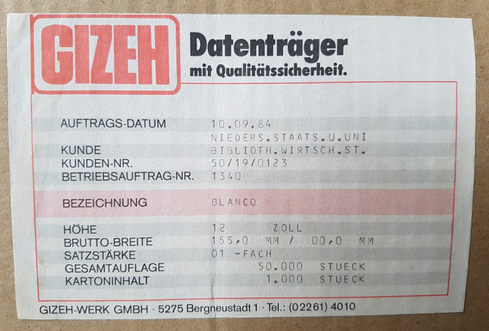

{width=100%}

## Weitere Grundbegriffe

* Datenträger

* Datenübertragung

* Datum

* Datensatz

* Datei

* Datenbank

* Metadaten

* Datenbanksystem

* ...?

## Zusammenfassung

Was kann gemeint sein wenn von Daten gesprochen wird?

* digital verfügbare **Fakten**
* digital aufgezeichnete **Beobachtungen**
* digitale **Dokumente** mit Kodierungs-Ebenen
 
Viele mögliche Ebenen der Datenmodellierung\
von **Vorstellungen** bis zu **Bits**
